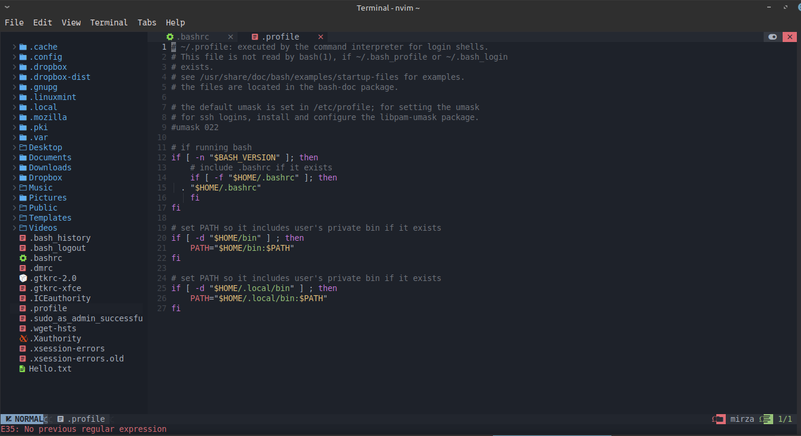
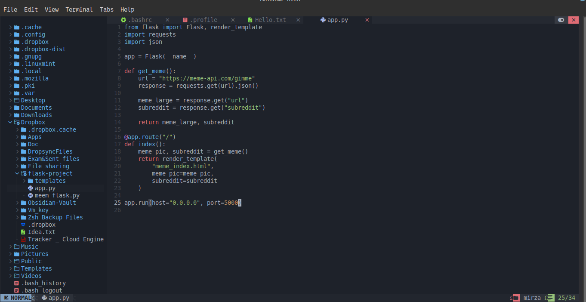

# Neovim - Code Editor


### 1). Install latest neovim 


```
 sudo add-apt-repository ppa:neovim-ppa/unstable && sudo apt update && sudo apt install neovim
```

- This will install neovim 10+ version

--- 

### 2)Install Nerd font For your Laptop
##### https://www.nerdfonts.com/


---

### 3). Create a Folder then Copy The Font in that 


```
mkdir -p ~/.local/share/fonts

cp ~/Downloads/*.ttf ~/.local/share/fonts/
```


### 4)🚀 Correct Fix (Clean Install)
Step 1 — Remove broken config
```bash
rm -rf ~/.config/nvim
rm -rf ~/.local/share/nvim
rm -rf ~/.cache/nvim

```

### Step 5 — Install NVChad correctly

```bash
git clone https://github.com/NvChad/starter ~/.config/nvim
```

⚠️ Important:
Use starter repo, not the core repo.
### Step 6 — Open nvim


```bash
nvim
```

Now automatically:

- lazy.nvim install will happen
- plugins download 
- themes apply 

⏳ wait 1–2 minutes

# DONE Boom

